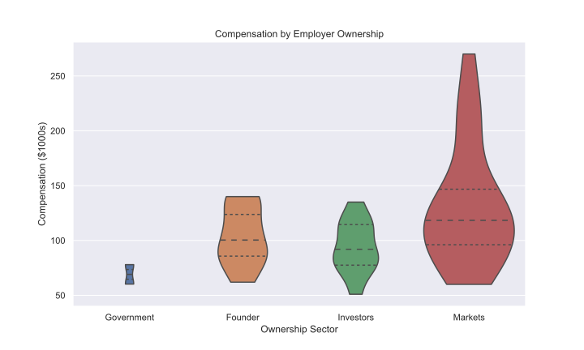

# Analysis of Survey Data

## Who Responded to the Survey?

Overall, a total of 82 people responded to the 2019 RocDev annual compensation survey.  Respondents spanned a wide range of educational backgrounds and professional experience. 

Most respondents had somewhere between 6 and 15 years of relevant work experience.

 

The large majority of respondents had a bachelor's degree, while just under 20% had a master's.

As is the general pattern in the software development and technology industry, men outnumber women by a significant margin.

 

The vast majority of respondents were employed in the private sector.  Around half of respondents worked for large, publicly traded companies (labeled as ownership by "Markets"), while the other half worked in privately held enterprises.  Of these privately held employers, approximately half (~25% of the total) were still controlled by their original founders.

Approximately one third of respondents reported working remotely, while the remainder were employed by a company with a local office.

 

The vast majority of respondents were engaged as full-time employees rather than as independent contractors.

Most respondents were not responsible for supervising other employees.

## What Was the Distribution of Compensation?

The average financial compensation for all respondents was around $110,000 and most fell in the range from $80,000 to $130,000 per year. Compensation was roughly normally distributed, but were skewed towards the higher end.

## How did Compensation Differ

With only 82 respondants not always spread evenly across the different categories, reliable statistical inference is somewhat limited.  This data is presented as a series of [violin plots](https://en.wikipedia.org/wiki/Violin_plot).  These plots are designed to show how the distribition of compensation compares acrosss several different categories.  These particular violin plots have the following properties:

- The total area of the violin is proportional to the number of respondants from that category.  For example, because only a few respondants worked for governments, the total size of that plot is considerably smaller than the others.
- The width of the violin at each vertical point corresponds to the estimated proportion of respondants at that level of compensation.
- The lines across each violin correspond to data quartiles, meaning that each sement between these lines represents the distribution of compensation for a quarter of the respondents.  The dashed line across the middle represents the median respondant.
- The tops and bottoms of each estimate are often more _pointy_, representing variability at the edges of the distribution--the tail of the bell curve.  However, in these plots, these ends have been removed in favor of a clearer delineation of the total range.

In general, reported financial compensation was lowest in the public sector and the higest at large publicly traded companies.  Employees were paid slightly more at privately-held businesses still controlled by their founders rather than investors, but there's not enough data here to say whether or not this is just a coincidence.

Compensation at larger companies was higher on average, especially at the top end.

Compensation was generally greater for remote workers for large companies compared with local employers. This is consistent with a lower cost of living in the Rochester area as compared with large metros (e.g., SF, NYC) where these employers are often located.

Overall, there was relatively little observed difference in financial compensation by education level.  The most notable feature here is that a master's degree is not associated with higher average compensation.

Salaries were unsurprisingly lower for entry level positions.  While an individual's compensation does generally increases through their career, this effect could not be seen in the aggregate--likely overwhelmed by the variability in specific jobs among respondents.

